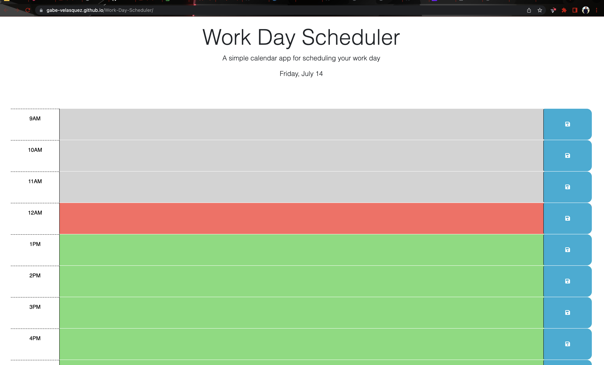

# Work-Day-Scheduler
## Introduction
Module 5 for our coding bootcamp. We are focusing on third-party APIs this week. This week we learned jquery and dayjs. Our task was to complete a scheduling app so the user can save notes to a time block and have it stay there once the page refreshes. Along with the save functionality we are using an API that tracks time and be able to use it in our code in the form of comparisons of hour blocks and change the blocks classes according to the current hour.  
## Installation
No installation required.
Application is deployed live at : https://gabe-velasquez.github.io/Work-Day-Scheduler/

## Usage
Built this application using jquery, bootstrap, dayjs, and html/css. A snapshot below shows how the application should be displayed for the user. 

## Credits
Xander (https://github.com/Xandromus) for providing starter code for this module. at the start of this project, I was wondering how to even start. I went through the lectures when we first introduced to jquery to get an idea on how to structure it. Finally understood it was like javascript but in some cases quicker. 

https://api.jquery.com/
I largely used the documentation for jquery on how to add/remove classes for my functions. Toggle classes was something I needed to get familiar with when working on this project. 

https://day.js.org/docs/en/installation/installation
the dayjs documentation came in handy when calling current time information. Had to read the documentation on how to format time specifics (in this case, hour). 

https://www.youtube.com/watch?v=kAQRLXIOPR4
Even though this video in typescript. I used this video from codedubb as a guide for how I can format variable once I called for dayjs. 
## License
Please refer to the LICENSE in the repo.
